일단 머신러닝과 딥러닝, 차이점이 뭘까?
-----------------------------------------

* 머신러닝    
모든 경우의 수에 대해 규칙을 만들어 주지 않더라도, 컴퓨터가 빅데이터를 기반으로 가치 있는 판단을 할 수 있게끔 학습하는 것.
인공지능의 하위 개념이다.

* 딥러닝    
ANN에 기반을 둔 머신러닝 기술의 한 종류이며 머신러닝의 하위 개념이다. 

그렇다면 Artificial Neural Network란 뭘까?
-------------------------------------------

인간의 뇌는 신호를 받은 뒤 그 신호를 처리해 다시 전달하는 세포인 뉴런의 집합체이다.    
즉 뇌의 구조는 굉장히 복잡하지만 그걸 구성하고 있는 연결체인 뉴런의 구조는 단순한 구조인데 이걸 기계로 만들어 보자는 생각에서 출발한 것이 ANN 인 것이다.    
아래는 간단하게 뉴런의 작동방식을 도식화한 그림이다.    
</img> 

이 그림을 보면 input으로 들어온 각 x 값에 weight인 w 값이 각각 곱해지고 더해진 뒤 bias 값을 추가로 더하고 나온 값을 Activation function에 통과시키면 최종적으로 output이 나온다는 걸 알 수 있다.    

뉴런을 여러개 모아본다면 대략 아래와 같은 구조가 된다.    
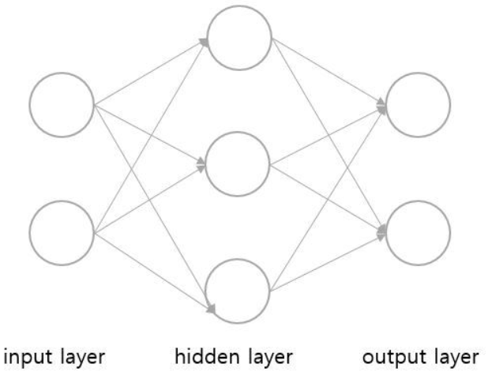</img> 

이는 가운데 hidden layer가 1개인 가장 단순한 Single Layer Network 구조로 이를 이용해 AND나 OR 문제 같은 선형방정식을 해결할 수 있었다.    
하지만 XOR 문제가 등장하며 더이상 Single Layer Network로는 이 문제를 해결할 수 없게 되었다.    
XOR 문제는 풀기 위해선 hidden layer가 2개 이상 쌓여진 Multi Layer Network가 필요했지만 Multi Layer를 어떻게 만들어야하는지, 어떻게 학습시켜야 하는지 알 수 없었기 때문에 머신러닝에 암흑기가 도래하게 된다.    
여담이지만 딥러닝이라는 이름도 이 hidden layer가 2개 이상 deep 하게 계속 쌓이는 것에서 유래된 것이다.    
하지만 후에 비선형 활성화 함수(Non-linear Activation function)과 Backpropagation 알고리즘의 도입으로 Multi Layer Network를 만들고 학습시킬 수 있게 되었다.    

그렇다면 활성화 함수(Activation function)이란?
-----------------------------------

활성화 함수란 위 그림에서 보다시피 노드에서 입력값을 처리한 뒤 출력하기 전 계산한 값을 변환하기 위한 함수이다.    
이 함수는 비선형 함수여야 하는데 그 이유는 선형함수를 사용할 시 Multi Layer를 만드는 의미가 없기 때문이다.     
예를 들어 선형함수 h(x) = cx를 활성화 함수로 사용하는 3-layer Neural Network가 있다고 가정해보자.    
해당 NN을 식으로 나타내면 y(x) = h(h(h(x)))가 되는데 이는 사실 c^3x와 같기 때문에 결국 선형함수 g(x) = c^3x를 활성화 함수로 사용하는 1-layer NN과 같은 결과를 내게 된다.       
즉 linear한 연산을 가지는 layer는 수십개를 쌓아도 선형 함수의 특징 때문에 결국 하나의 linear 연산으로 나타낼 수 있기에 활성화 함수는 비선형 함수로 사용해야 하는 것이다.    
초기엔 활성화 함수로 아래의 sigmoid function을 사용했다.    
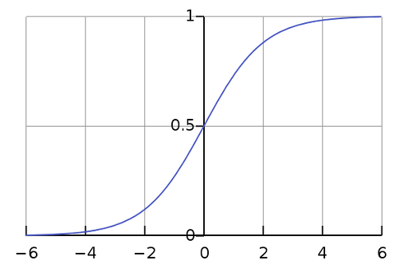</img> 

이제 활성화 함수를 이용해 Multi Layer Network를 만들 수 있게 되었다.    
딥러닝이라고 부를 수 있는 네트워크 구조가 만들어지기 시작한 것이다.    
그렇다면 이 Multi Layer, 딥러닝은 어떻게 학습시켜야 하는 걸까?

그래서 나온 Backpropagation
-----------------------------

역전파 알고리즘이라고도 불리는 backpropagation 알고리즘은 오늘날 ANN을 학습시키기 위한 일반적인 알고리즘 중 하나이다.   
이 알고리즘의 구조는 아주 단순한데, 학습 결과로 나와야하는 target 값과 실제 모델을 통과하며 나온 output 값이 얼마나 차이가 나는지 구한 후 그 오차값을 뒤의 노드들에게 알려주면서 이 오차값이 0에 가까워지도록 각 노드가 가지고 있는 변수들(weight나 bias)을 갱신하는 것이다. 
그렇다면 각 weight나 bias를 어떻게, 얼마나 갱신해야 할까?      
이 문제들은 Chain Rule 법칙을 사용해 해결할 수 있었다.    

Chain Rule?
-------------

Chain rule은 미분의 연쇄법칙이라고도 불리는 법칙으로 아래와 같이 정의된다.    
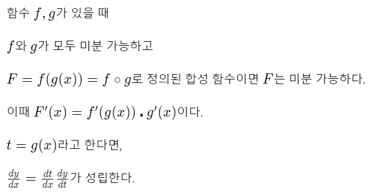</img> 

미분을 구한다는 것은 변화량을 구한다는 것과 같다.    
이 정의에 따르면 x가 변화했을 때 g(x)의 변화량을 알 수 있고    
g가 변화했을 때 f(x)의 변화량을 알 수 있고    
최종적으로 F의 변화량에 기여하는 f, g의 기여도 정도를 알 수 있다.    
이는 변수가 여러 개일때도 동일하게 적용된다.    
이제 본격적으로 Backpropagation이 어떤 식으로 진행되는지 알아보자.    

Backpropagation 진행 과정
-----------------------

일단 먼저 Forward propagation을 진행해야한다.     
단어는 거창하지만 그냥 초기화한 weight와 bias, input 값을 가지고 일단 네트워크를 통과시켜 output이 얼마가 나오는지, target 값과 얼마나 차이가 나는지를 보는 과정이다.    

이번 예시에서 사용할 2-layer NN은 다음과 같다. weight와 input은 임의의 값으로 초기화한 상태이고 활성화 함수로는 sigmoid 함수를, 오차값 계산을 위한 error function으로는 MSE(Mean Squared Error) 함수를 사용한다.    
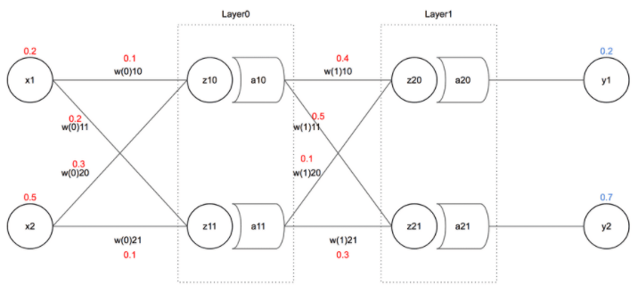</img> 

layer 0에 input으로 들어오게 되는 값을 계산해보자. 행렬 곱을 이용해 풀어보면 아래와 같이 wx들의 합의 형태로 나타나게 된다.     
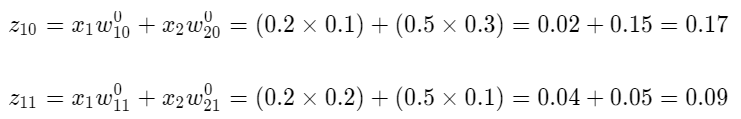</img> 

구한 z10과 z11 값을 활성화 함수인 sigmoid 함수에 넣어 a10과 a11을 구해보면 아래와 같다.     
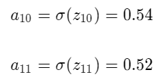</img> 

이런 방식으로 y1과 y2를 구해보면 y1 = 0.57 / y2 = 0.61 이 나온다.     
이는 우리가 원했던 y1 = 0.2과 y2 = 0.7 값과 차이가 나는데 이 오차 E를 MSE 함수를 이용해 구해보자. 나와야하는 값을 t로, 실제 나온 값을 y라고 할 때 오차 E는 아래와 같다.     
</img> 

이제 나온 이 오차 E를 Backpropagation 하기만 하면 된다!     

Forward propagation을 통해 구해진 layer 0과 layer 1을 살펴보면 아래와 같다.    
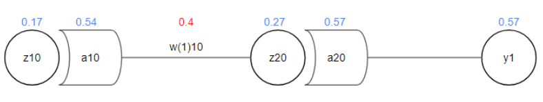</img> 

학습시켜야 할 값은 weight와 bias 뿐이므로 0.4로 초기화했던 w(1)10 값을 업데이트해보자.    
그러기 위해선 w(1)10이 전체 에러인 E에 얼마나 영향을 미쳤는지에 대한 정도를 구해야 하는데 바로 이때 위에서 설명한 Chain rule이 사용된다.       
E에 대한 w(1)10의 기여도를 식으로 풀어보면 다음과 같다.    
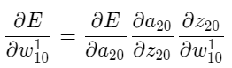</img> 

먼저 첫번째 항부터 계산해보자. MSE에 따르면 E는 아래와 같이 나타낼 수 있었다.    
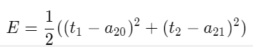</img> 

위 식을 a20에 대해 편미분해 첫번째 항을 구하면 아래와 같다.    
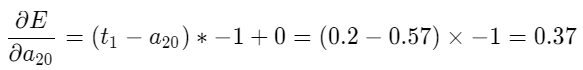</img> 

이 계산 결과로 전체 에러 E에 대해 a20이 0.37만큼 기여했다는 것을 알 수 있다.    
이런 식으로 두번째 항과 세번째 항도 계산해보면 아래와 같다.    
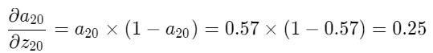</img> 
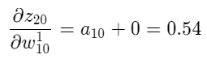</img> 

최종적으로 E에 w(1)10가 기여한 정도는 아래와 같다.    
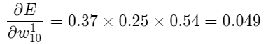</img> 

이제 이 값을 학습식에 넣으면 w(1)10을 업데이트할 수 있다.    
이때 학습 속도를 조절하는 hyper parameter인 learning rate가 필요하다. Hyper parameter란 딥러닝을 모델링할 때 사용자가 직접 세팅해주는 값을 말한다. 이 값은 정해진 최적의 값이 없으므로 학습을 진행하면서 최적의 값을 직접 찾아가야 한다.    
learning rate는 보통 0.1보다 낮은 값으로 설정하고 학습을 진행시킬 수록 작아지게 설정하는 것이 일반적이나 이번 예시에서는 그냥 0.3으로 잡고 계산해보자.     
새로 갱신될 w(1)10 값은 기존의 w(1)10 값에 learning rate * (전체 에러 E에 w(1)10이 기여한 정도) 값을 더하거나 빼서 계산된다.    
나와야 하는 target 값(0.2)이 실제로 나온 output 값(0.57)보다 작으므로 weight를 낮춰줘야 한다.     
최종적으로 갱신되는 w(1)10은 아래 식과 같다.    
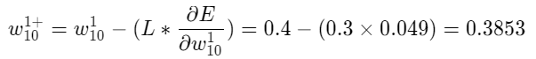</img> 

