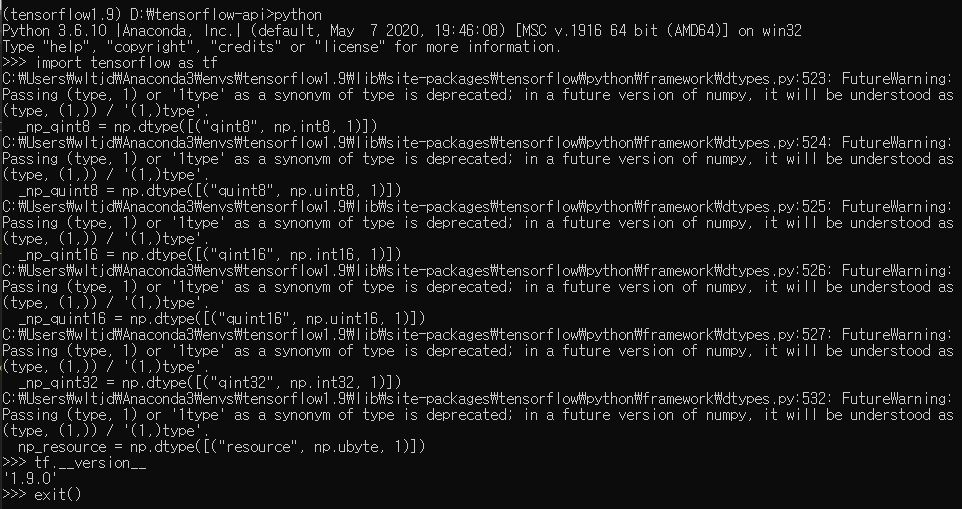
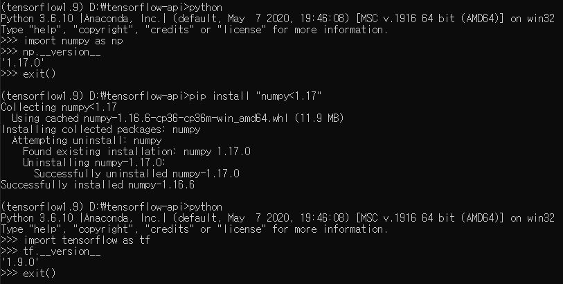

그 전 폴더에서 설명한대로 아나콘다 가상환경에 텐서플로우를 깔고 import tensorflow 를 해보면 짜증나는 future warning이 뜨는 걸 볼 수 있다.          

에러는 아니기에 작동은 되지만 보기에 거슬리므로 future warning을 없애는 방법을 배워보자!            

​                  

**경고 메시지 내용**

------------------

기존에는 [(name, dtype, 1)] 또는 "1type"이 스칼라 타입, 즉 [(name, dtype)] 또는 [(name, dtype, ())] 으로 다루어졌지만, 1.17 버전에서는 [(name, dtype, (1,))] 또는 "(1,)type"으로 취급된다는 내용이다.             

	

​             

**간단한 해결책**

--------------------------------

기존에 설치되어 있던 numpy 버전이 1.17 이상이어서 생기는 경고이므로 설치되어 있는 numpy를 제거하고 1.17 아래 버전으로 재설치하면 문제가 해결된다.                    

	

