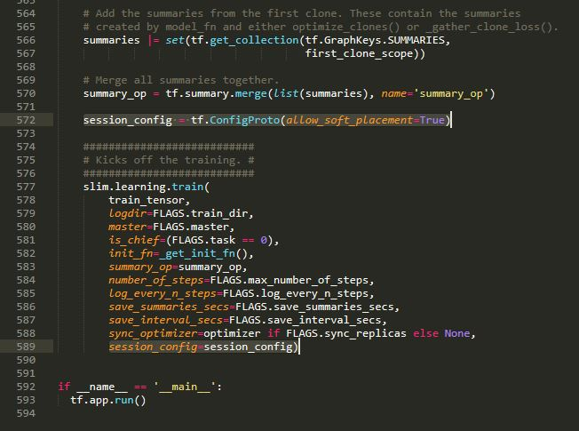

tensorflow를 설치했으니 이제 slim 라이브러리를 이용해 image classification 실습을 할 차례다!                     

실습은 https://github.com/tensorflow/models/tree/master/research/slim 를 따라 진행한다.         

​                      

**slim 라이브러리 설치 및 이미지 데이터셋 다운로드**

------------------

https://github.com/tensorflow/models/tree/r1.9.0                

위 링크에 들어가보면 tensorflow로 구현된 모델들이 다 모여있다. (친절해!) 여기서 주의할 점은 master 브랜치가 아닌 r1.9.0 브랜치를 봐야한다는 것!              

master 브랜치는 최신 tensorflow 버전 전용이라 tensorflow 1.9 와는 import 라이브러리 버전 충돌이 나기 때문이다.              

암튼 research 폴더에 들어가보면 RNN도 있고 auto encoder도 있다.              

쭉 구경해주다가 깃 저장소를 zip 으로 다운로드 받고 적당한 위치에 압축을 푼다. 파일 형태이기 때문에 따로 설치 과정도 필요없고 그냥 압축을 푼 폴더에서 실습을 진행하면 된다. 나는 D 드라이브 밑에 tensorflow-api 폴더를 만들어서 거기에 풀었다.                          

research > slim 폴더로 들어가면 아래와 같은데 각각의 파일이 뭐하는 파일인지 간단히 살펴보면

<div align="center" style="display:flex;">
	
</div>


* download_and_convert_data.py : 학습할 이미지를 다운받고 TFRecord 포맷으로 생성 
* train_image_classifier.py : 학습용 이미지 데이터셋을 이용해 학습
* eval_image_classifier.py : 학습된 모델 정확도 평가
* slim_walkthrough.ipynb : slim 코드 사용법을 설명하는 파일

​                    

**이미지 데이터 다운로드 및 TFRecord로 변환**

--------------------------------

이번엔 custom dataset 말고 웹상에 있는 데이터셋을 이용한 이미지 분류 모델을 만들어보도록 하자. custom dataset을 이용한 이미지 분류 모델 생성은 다음 폴더에서!          

이번엔 flowers 이미지 데이터를 이용해보자.           

먼저 research > slim > datasets 의 download_and_convert_flowers.py 를 열어서 210 라인을 주석처리해줘야 한다. 이 줄은 모델 학습 후에 다운받은 flowers 이미지 데이터의 원본 파일을 지워버리는 코드인데 나중에 custom dataset을 학습시킬 때 flowers 이미지 데이터 폴더 구성을 참고해야하기 때문에 없애버리면 안되기 때문!          

<div align="center" style="display:flex;">
	
</div>


이제 anaconda prompt를 열고 research > slim > datasets 폴더로 가서 아래 명령어를 실행시켜보자. 이 때 tensorflow를 깐 가상환경을 꼭 활성화시켜줘야한다는 점 명심!                

```python
python download_and_convert_data.py --dataset_name=flowers --dataset_dir=/tmp/flowers
```

dataset_dir엔 flowers 이미지 데이터와 그걸 TFRecord 포맷으로 변환시킨 결과를 저장할 경로를 써주면 된다.      

경로에 가보면 train 용 파일 5개와 validation 용 파일 5개, 분류 클래스가 정의된 labels 파일이 생성된 걸 확인할 수 있다. 이제 학습시엔 원본 이미지를 사용하지 않고 이 TFRecord 포맷 파일을 사용한다!

​                  

**드디어 모델 학습, 그런데 이제 밑바닥부터 시작하는**

-----------------------

학습 방법엔 크게 2가지가 있다. 

하나는 'Training a model from scratch'이고 다른 하나는 'Fine-tuning a model from an existing checkpoint' 이다.                    

전자는 완전히 새롭게 모델을 만드는 방법이고 후자는 이미 만들어진 모델에 추가 이미지를 학습시켜 모델을 리모델링하는 방법이다. 효율성과 시간을 생각해보면 후자 방식이 아주 좋다. 특히 요새는 좋은 이미지 모델들이 많아서 후자의 방법으로 하는게 더 좋다! 하지만 이번엔 두 방식을 비교해보고자 모델을 완전히 새롭게 만드는 방법부터 해보자.             

다운받은 flowers 데이터셋을 가지고 inception V1 모델을 학습시켜보자. (이 모델은 낮은 컴퓨터 사양에서도 돌아가는 저사양 딥러닝 네트워크 모델이다)                    

research > slim > train_image_classifier.py 파일을 열고 마지막 부분에 아래 사진의 드래그 된 부분을 추가하고 anaconda prompt에서 research > slim 폴더로 이동한 후 

<div align="center" style="display:flex;">
	
</div>

>python train_image_classifier.py
>
>--train_dir=\tmp\train_inception_v1_flowers_logs   #모델 저장될 폴더
>
>--dataset_name=flowers   #데이터셋 이름
>
>--dataset_split_name=train   #데이터셋 중 하급에 사용될 이미지 선택
>
>--dataset_dir=\tmp\flowers   #데이터셋 위치
>
>--batch_size=16   #이미지 학습 batch size. 보통 32나 16을 사용. 메모리 부족 에러가 발생한다면 줄여줘야함
>
>--model_name=inception_v1   #사용할 모델 이름

```python
python train_image_classifier.py --train_dir=\tmp\train_inception_v1_flowers_log --dataset_name=flowers --dataset_split_name=train --dataset_dir=\tmp\flowers --batch_size=16 --model_name=inception_v1
```

위 명령어를 입력해주면 step이 올라가면서 학습이 진행되는 것을 확인할 수 있다. 이 때 아무런 파라미터 변수 서렁을 안하고 실행시켰기 때문에 네트워크 기본 값으로 학습이 진행된다. 자세한 파라미터 값을 알고 싶다면 train_image_classifier.py 파일을 보면 된다. 만약 학습을 중단시키고 싶다면 ctrl+c를 누르면 된다.       

학습이 끝난뒤 모델 저장 위치로 지정한 폴더로 가면 모델이 ckpt 형태로 생성된 것을 확인할 수 있다. 찾아보면 알겠지만 텐서플로우에서는 다양한 형태로 학습된 모델을 저장할 수 있는데 

+ ckpt 파일 : 텐서플로우에서 학습된 모델의 구조를 제외한 변수들을 담고 있는 파일, 즉 모델의 가중치만 담고 있는 파일이다. 그래서 재학습이 가능하다는 장점이 있지만 실제 모델을 돌릴 때 필요없는 정보들도 많이 담고 있어 크기가 무겁다는 단점이 있다. 

